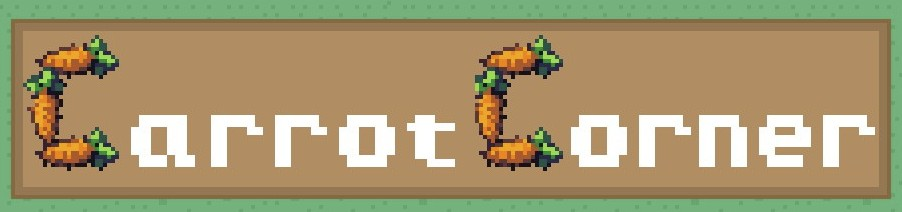
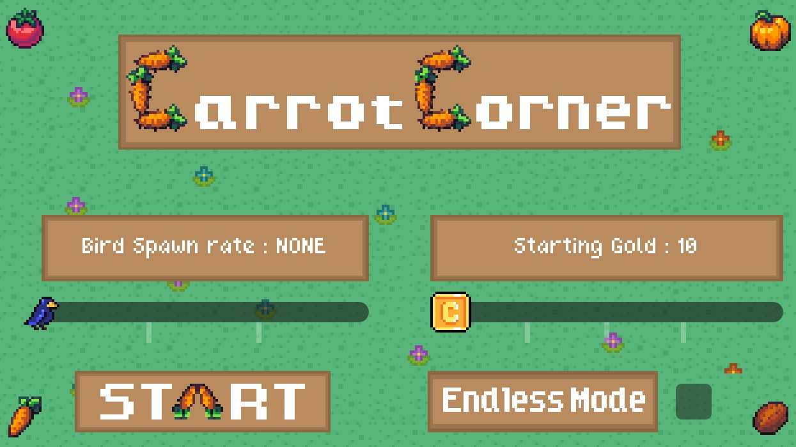
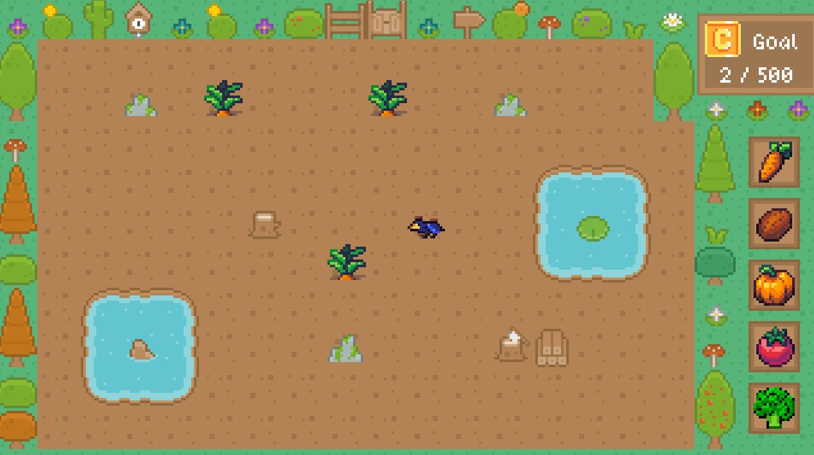

# 

First Godot Farming game for the purpose of learning....for Tadhg!!

## Screenshots

# 

# 

## Play on Itch :
https://yummyjibblybits.itch.io/carrotcorner

### Assets Credits :
	
	Kennys : https://kenney.nl/assets/roguelike-rpg-pack
	Bird : https://ma9ici4n.itch.io/pixel-art-bird-16x16
	Coin : https://totuslotus.itch.io/pixel-coins
	Veg : https://emanuelledev.itch.io/farm-rpg
	
	
Music :
	
https://pixabay.com/users/dream-protocol-9556087

SFX : 
	
https://pixabay.com/users/dragon-studio-38165424/

### TODOs and Extra Features
- Adjust resolution for mobile
	
- Adjust end limit goal
- Gold can be spent on scarecrow - Auto punch birds
- Add new game mode
	- Target planted areas spell out a letter. If you can plant and maintain these areas, extra gold
	- Birds will prioritize them
	- Bonus point for guessing the letter maybe?
